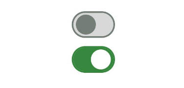
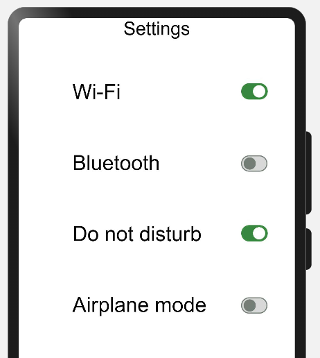
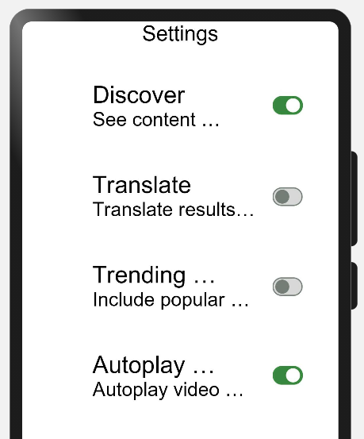
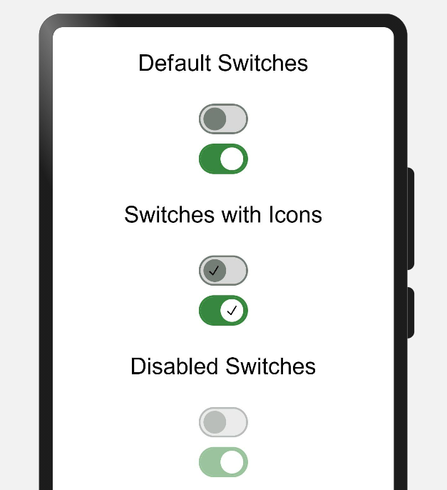
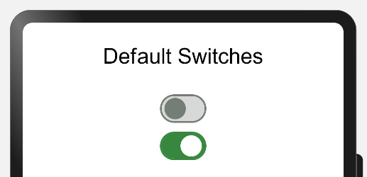
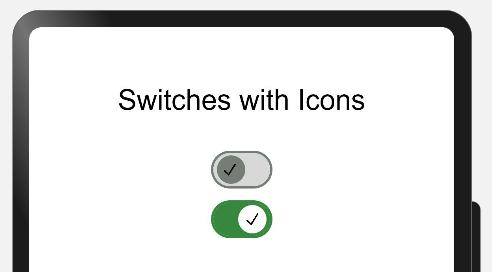
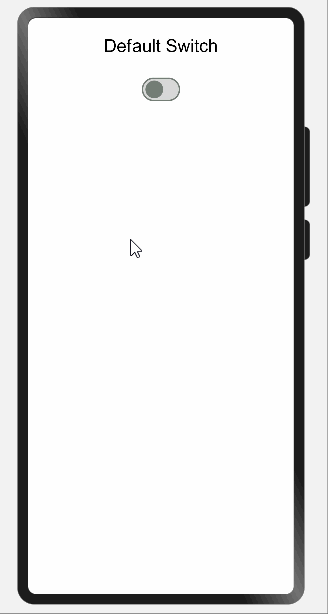
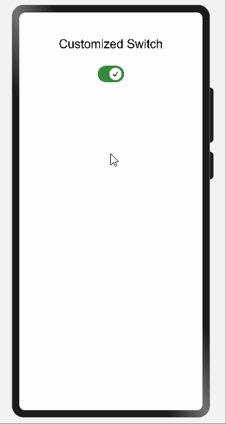

## 1. Introduction

A **Switch** is a component which provides only 2 options either enabled or disabled. This is best used in the scenario where users need to enable or disable any function. Users can enable and disable the switch by just clicking on it.

A Switch is like a circular space on a small line or inside a cylindrical  container. Generally circular space at the right side means enabled and left side means disabled. While enabled it has some color and while disabled it is colorless.

Below is an example of a switch:



Developers can develop their custom switch containing text, icon, animation etc.

## 2. Benefits

* Provides better user experience while dealing with independently controlled items.

## 3. Typical UseCases:

MaterialSwitches can be implemented in most of the commonly used applications where users need to either enable or disable any functionality. Below are some of the examples:

 s

## 4. List of Features:

There are few features of Radio buttons listed below:

|Features|Description|
|:-:|:-:|
|On-State|Can be enabled or disabled|
|Off-State/Enabled|By default functionality is enabled and can't be changed|
|Off-State/Disabled|By default functionality is disabled and can't be changed|
|Customized|Can contain some icons or some texts as developers choice|
|||

Please refer below Image: 



## 5. Download & Install:

Install using npm: 
```
npm i @ohos/material-switch
```

Details about OpenHarmony NPM environment configuration, click [here](https://gitee.com/openharmony-tpc/docs/blob/master/OpenHarmony_npm_usage.md). 

<hr/>

## 6. Usage Instructions:

1. Import files and code dependencies

```
import { Switch, SwitchModel }  from "@ohos/material-switch"
```

2. Initialize switch model data

```
private model: SwitchModel.Model = new SwitchModel.Model();
```

3. Code for creating default switch

```
this.model.reset()

Switch({
    model: this.model,
    onSelect: (id, isOn) => {
            prompt.showToast({
              message: id.toString()
    })
})
```



4. Code for creating custom switch with icon

```
    this.model.reset()
    this.model.setSwitchId(1)
    this.model.setWithIcon(true)
    this.model.setIsOn(true)
    this.model.setIcon($r('app.media.tick'))

Switch({
    model: this.model,
    onSelect: (id, isOn) => {
            prompt.showToast({
              message: id.toString()
    })
})
```



## 7. Library Features:

### Feature-1: 

***Description:*** A default toggle switch is provided by the library.

***Code Snippet:***

```
updateModelForFirst() {
    this.switchModel1.reset()
    this.switchModel1.setSwitchId(1)
}

Switch({
    model: this.switchModel1,
    onSelect: (id, isOn) => {
        prompt.showToast({
            message: id.toString()
        })
    }
})
```
***Explanation:***

In above code one switch was created whose all attributes values were resetted to default one and then switch id assigned with value 1. While clicking the button one toast will appear showing the ***id*** of the switch.


***Below are list of properties available:***

|Properties|Description|
|:-:|:-:|
|`setSwitchId(number)`|Providing id to switches|
|`reset()`|Will initialize the value of all attributes with default value|
|||

***Screenshot:***



<br>

### Feature-2: 

***Description:*** User can create a customized toggle switch based on the parameters passed.

***Code Snippet:***

```
updateModelForFourth() {
    this.switchModel4.reset()
    this.switchModel4.setSwitchId(4)
    this.switchModel4.setIsOn(true)
    this.switchModel4.setWithIcon(true)
}

Switch({
    model: this.switchModel4,
    onSelect: (id, isOn) => {
        prompt.showToast({
            message: id.toString()
        })
    }
})
```

***Explanation:***

In above code one customized switch was created whose all attributes values were resetted to default one and then switch id assigned with value 4 and by default switch was made enabled and having tick icon in circular space.Tick icon is default icon getting selected while calling reset() function. Developers can use any other icons as well. While clicking button one toast will appear showing the ***id*** of the switch i.e. ***4***.

***Below are list of properties available:***

|Properties|Description|
|:-:|:-:|
|`setSwitchId(number)`|Providing id to switches|
|`reset()`|Will initialize the value of all attributes with default value|
|`setIsOn(boolean)`|By default making switch enabled or disabled|
|`setWithIcon(boolean)`|It will add or remove the icon added in Switch|
|||

***Screenshot:***



## 8. Conclusion:
This library is for using toggle switches that can be customized based on colors, an icon passed by the user and also be set to disabled or On/Off state.

## 9. Code Contribution:
If you find any problems during usage, you can submit an [Issue](https://github.com/Applib-OpenHarmony/MaterialSwitch/issues) to us. Of course, we also welcome you to send us [PR](https://github.com/Applib-OpenHarmony/MaterialSwitch/pulls).
